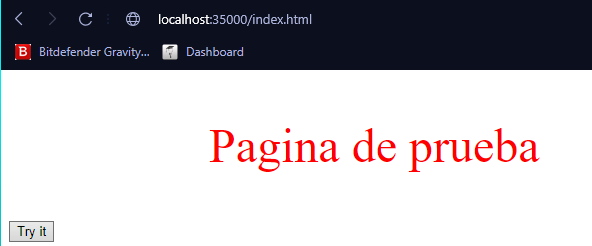
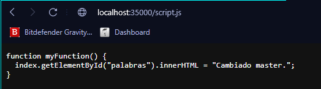
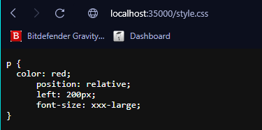

# Taller 3 AREP

Framework que emula spark, a traves de funciones lambda GET y POST

## Empezando

Con el paso a paso se obtendra una copia de esta aplicacion y podra ser utilizada para acceder a distintos recursos guardados de forma local

### Pre requisitos

1. Git: Descarga y administracion versiones repositorio.
2. Java: Lenguaje utilizado.
3. Maven: Controlador del proyecto.


### Installing

Clonamos el repositorio

```
git clone https://github.com/cisfjulian/AREP_Lab2.git
```

Entramos a la ubicacion donde se clono el repositorio y a traves del cmd ejecutamos el siguiente comando
(Tener en cuenta que se debe tener configurado maven)

```
mvn clean package exec:java -D"exec.mainClass"="eci.arep.services.App"
```

Luego de ejecutar y que el maven compile, en nuestro navegador preferido colocaremos en la barra de busqueda
*localhost:35000/*
Donde seguido colocaremos index.html para observar la pagina de prueba realizada, tambien se puede observar el 
codigo de javascript realizado, y el css. Con script.js y style.css


## Javadoc

Para generar el javadoc ejecutamos el siguiente comando

```
mvn javadoc:javadoc
```

Posterior a ello debemos ir a la carpeta target -> site -> apidocs y alli encontraremos toda la informacion relacionada.

## Test

Pruebas que la aplicacion funciona accediendo a los distintos archivos








## Construido con

* Maven - Manejo de dependencias y proyecto en general.

## Version

1.0

## Autor

* **Julian Largo**

## Diseño y Extension

Funciones lambda que permite acceder a diversos archivos estaticos, determinado que tipo de archivo es y 
visualizandolo en el navegador.
Uso de GET y POST.
